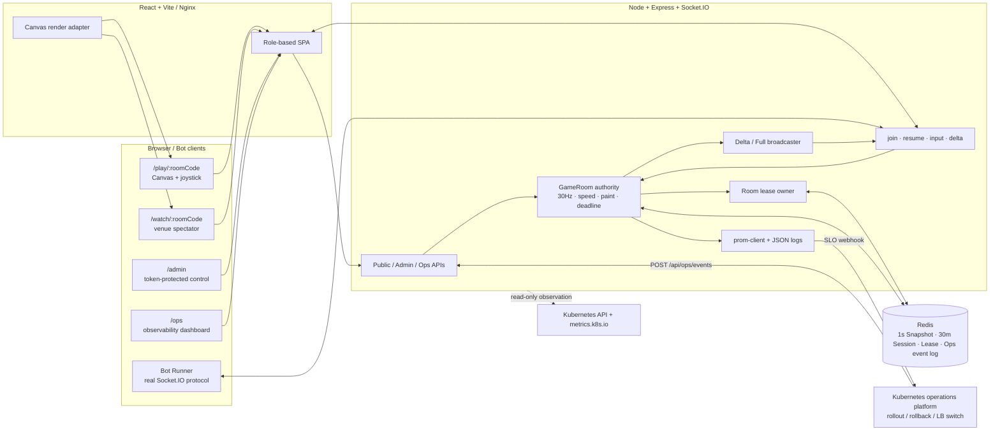
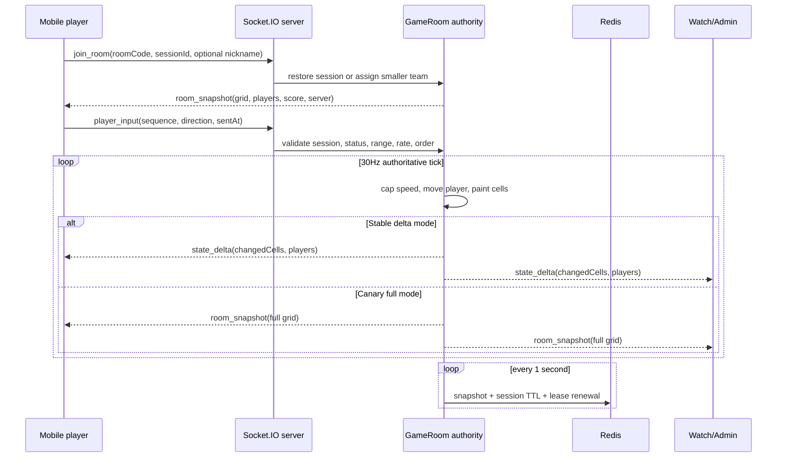
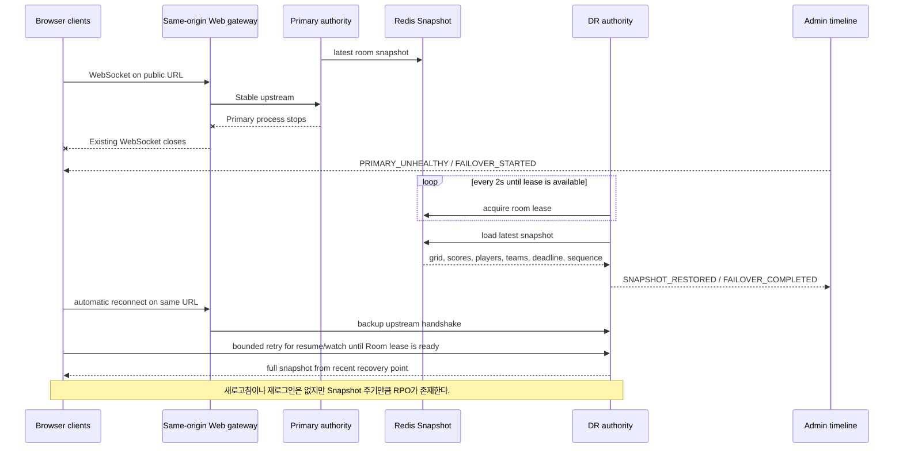

# Color Turf Arena 아키텍처

## 런타임 구조

## Snapshot과 Delta

## 장애복구 흐름

로컬 Compose는 Stable과 DR을 별도 프로세스로 실행하고 Web Nginx가 Stable 우선/DR 백업 upstream을 제공한다. Stable 종료 뒤 새 handshake만 DR로 전달되므로 기존 WebSocket은 한 번 끊기며, 클라이언트가 같은 공개 URL에서 자동 재접속한다. 실제 두 cluster 사이의 Service/DNS/LB 전환과 공유 Redis는 운영 플랫폼 책임이다.

## 상태 소유권

| 상태 | 실제 소유자 | 전송/소비자 |
| --- | --- | --- |
| 팀, 위치, Grid, 점수, deadline | `GameRoom` server authority | Snapshot/Delta → 모든 화면 |
| Session identity와 복구점 | Redis Snapshot storage | 재시작·Failover 복구 |
| Room single writer | Redis lease owner | server start/renew/release |
| Stable/Canary mode | Room `releaseChannel` + server config | version/broadcast metrics/UI |
| 배포·Rollback 이벤트 | 외부 운영 플랫폼 | `/api/ops/events` → Timeline |
| 최근 운영 이벤트 | Redis shared log (최대 200개) | Stable/DR `/api/ops`에서 merge/dedupe |
| Tick/Broadcast/Payload/RTT | 실제 runtime collector | `/metrics`, `/ops`, `/admin` |
| Pod/replica/restart/CPU/memory | Kubernetes API/Metrics Server | `/ops` actual card |
| Canary full broadcast와 부하 | Room mode + 실제 WebSocket Bot | 실제 payload/Tick/CPU 지표에 영향 |
| OOM 장애 주입 | 명시적으로 허용된 Kubernetes Pod | 실제 cgroup 메모리와 Pod restart에 영향 |

## 중요한 설계 결정

- 기존 npm workspace, React/Vite, Express/Socket.IO 코드를 유지했다. 새 요구의 pnpm/Fastify/Tailwind 전환은 기능과 무관한 재작성 위험이 커서 하지 않았다.
- Redis에는 매 입력을 쓰지 않고 1초 Snapshot만 저장한다. 쓰기 부하를 줄이는 대신 최대 Snapshot 주기만큼 RPO를 인정한다.
- Socket.IO gateway와 Room 명령은 Redis adapter/command bus로 여러 서버 사이에 전달한다. 게임 Tick은 Room lease를 가진 단일 authority만 수행해 중복 writer를 막는다.
- authority는 lease를 2초마다 갱신한다. 갱신 실패 시 Room을 내리고 client를 끊어 split-brain을 피하며, 대기 인스턴스는 7초 TTL 만료 후 Snapshot을 재획득한다.
- WebSocket handshake가 DR의 Room 복구보다 먼저 성공할 수 있으므로 참가·관전·관리자 구독은 ACK timeout과 bounded exponential backoff를 사용한다.
- 운영 이벤트 POST는 Redis 공유 로그 저장이 끝난 뒤 202를 반환한다. 저장 실패 시 503을 반환해 장애 타임라인을 저장한 것처럼 표시하지 않는다.
- Canary는 같은 Room의 일부 플레이어를 분리하지 않고 Room 단위로 `stable/canary`를 고른다.
- 실제 OOM 주입은 `ALLOW_DEMO_OOM_KILL=true`인 격리된 Kubernetes 데모 환경에서만 허용한다. 로컬 Compose 기본값은 비활성화다.
