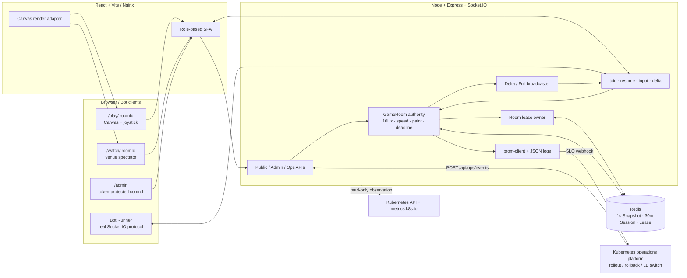
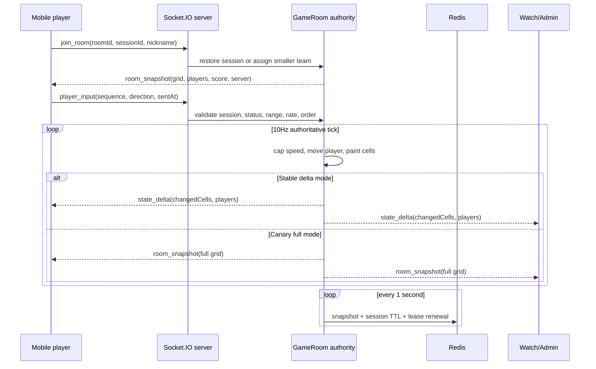
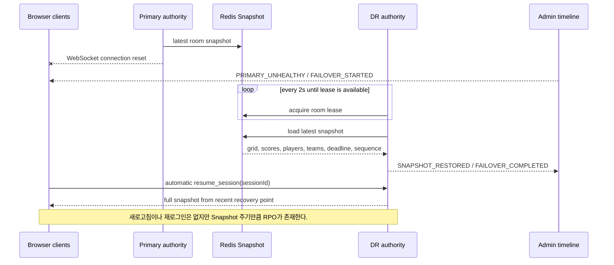

# Color Turf Arena 아키텍처

## 런타임 구조

## Snapshot과 Delta

## 장애복구 흐름

로컬 Chaos Control은 같은 프로세스가 Redis Snapshot을 다시 읽고 identity를 `DR`로 바꾸는 방식으로 복구 코드 경로를 검증한다. 실제 두 cluster 사이의 Service/DNS/LB 전환은 운영 플랫폼 책임이다.

## 상태 소유권

| 상태 | 실제 소유자 | 전송/소비자 |
| --- | --- | --- |
| 팀, 위치, Grid, 점수, deadline | `GameRoom` server authority | Snapshot/Delta → 모든 화면 |
| Session identity와 복구점 | Redis Snapshot storage | 재시작·Failover 복구 |
| Room single writer | Redis lease owner | server start/renew/release |
| Stable/Canary mode | Room `releaseChannel` + server config | version/broadcast metrics/UI |
| 배포·Rollback 이벤트 | 외부 운영 플랫폼 | `/api/ops/events` → Timeline |
| Tick/Broadcast/Payload/RTT | 실제 runtime collector | `/metrics`, `/ops`, `/admin` |
| Pod/replica/restart/CPU/memory | Kubernetes API/Metrics Server | `/ops` actual card |
| Chaos delay/full/failover | 명시적인 Admin Chaos API | 실제 game loop/Socket에 영향 |

## 중요한 설계 결정

- 기존 npm workspace, React/Vite, Express/Socket.IO 코드를 유지했다. 새 요구의 pnpm/Fastify/Tailwind 전환은 기능과 무관한 재작성 위험이 커서 하지 않았다.
- Redis에는 매 입력을 쓰지 않고 1초 Snapshot만 저장한다. 쓰기 부하를 줄이는 대신 최대 Snapshot 주기만큼 RPO를 인정한다.
- Socket.IO Redis adapter 없이 Room당 authority는 하나다. lease가 중복 writer를 막으며, API 수평 확장은 adapter와 sticky routing 이후에만 해야 한다.
- authority는 lease를 2초마다 갱신한다. 갱신 실패 시 Room을 내리고 client를 끊어 split-brain을 피하며, 대기 인스턴스는 7초 TTL 만료 후 Snapshot을 재획득한다.
- Canary는 같은 Room의 일부 플레이어를 분리하지 않고 Room 단위로 `stable/canary`를 고른다.
- `ALLOW_DEMO_SERVER_SHUTDOWN=true` 없이는 shutdown API가 409를 반환한다. 데모 Backdoor가 기본 활성화되지 않는다.
